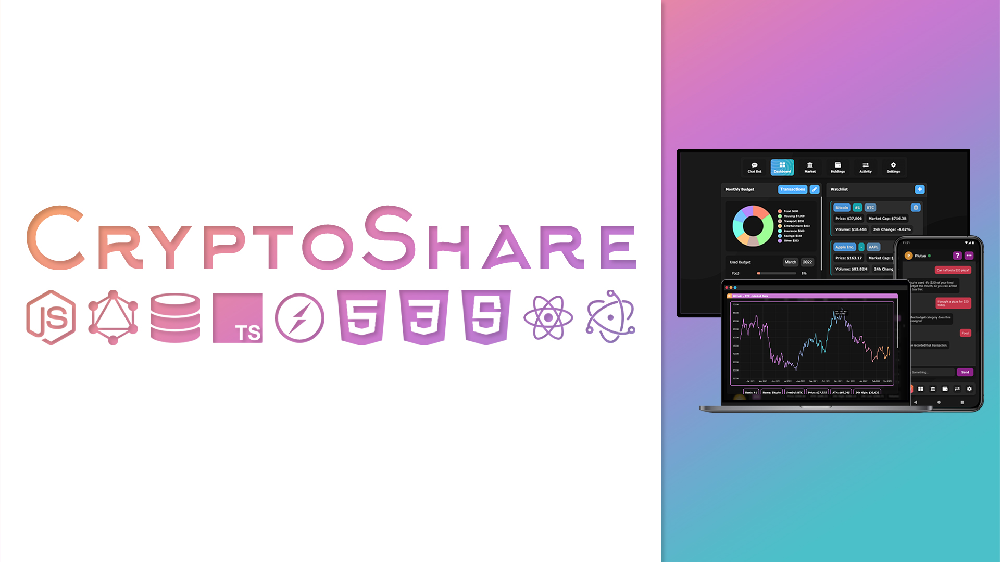
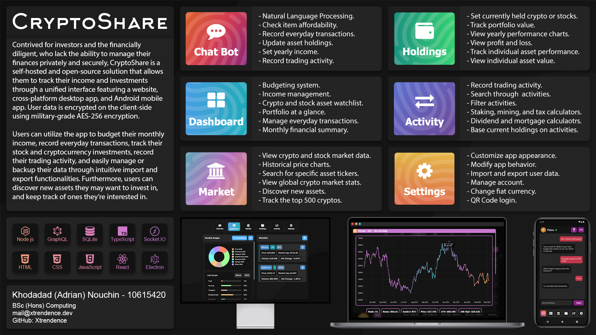

# CryptoShare

### Disclaimer

This is a piece of university coursework as part of my final year project.

### Brief Demo

A brief video has been recorded to [show the application running](https://www.youtube.com/watch?v=nyzBvKHnYas).

### Setup Instructions

Please see the [following file](./SETUP.md) for setup instructions.

### Project Supervisor

The supervisor for this project is [Shirley Atkinson](https://www.github.com/shirleyatkinson).

### Project Vision

Contrived for investors and the financially diligent, who lack the ability to manage their finances privately and securely, CryptoShare is a self-hosted and open-source solution that allows them to track their income and investments through a unified interface featuring a website, cross-platform desktop app, and Android mobile app. User data is encrypted on the client-side  using military-grade AES-256 encryption.

Users can utilize the app to budget their monthly income, record everyday transactions, track their stock and cryptocurrency investments, record their trading activity, and easily manage or backup their data through intuitive import and export functionalities. Furthermore, users can discover new assets they may want to invest in, and keep track of ones they’re interested in.

### Security

One of CryptoShare's main priorities is data protection and security. While most software encrypts data on the server-side, CryptoShare does it on the client-side no matter what. When you register an account, an encryption key is locally generated for you before being encrypted using your password. The encrypted key is then sent to the server, along with an RSA encrypted version of your password. The server then stores the encrypted key, and hashes your password. This means that even if the data stored on the server is stolen, the hackers cannot access any of your data unless they were to modify the API's code to decrypt your password **during** login, and use it to access your encryption key and subsequently your data.

User data such as activities, holdings, transactions, budget data, settings etc. are all encrypted with `AES-256`. Passwords are hashed using `bcrypt`. When logging in or creating an account, user details are encrypted using `RSA`, so even if the API doesn't support SSL/HTTPS, data is still encrypted when being sent.

### Tech Stack

- Database: SQLite

- App API: Node.js, TypeScript, GraphQL

- Chat Bot API: Node.js, TypeScript, Socket.IO, Natural Language Processing

- Web App: HTML, CSS, JavaScript

- Desktop App: Electron, EJS, HTML, CSS, JavaScript

- Mobile App: React Native, TypeScript

### Do you accept donations?

If you'd like to donate, then please feel free to do so, it'd be much appreciated. However, I don't want you to feel obliged to do so, and there are no perks for it. If you decide to donate, please contact me afterwards so I can actually thank you, and I'd love to hear about any ideas you may have for CryptoShare. If they're within the scope of the project, I'll probably implement them.

Click on the collapsible items in the list below to view the corresponding donation address.

	
<b>ADA</b>

	 
	addr1qyh9ejp2z7drzy8vzpyfeuvzuej5t5tnmjyfpfjn0vt722zqupdg44rqfw9fd8jruaez30fg9fxl34vdnncc33zqwhlqn37lz4

	
<b>XMR</b>

	 
	49wDQf83p5tHibw9ay6fBvcv48GJynyjVE2V8EX8Vrtt89rPyECRm5zbBqng3udqrYHTjsZStSpnMCa8JRw7cfyGJwMPxDM

	
<b>ETH</b>

	 
	0x40E1452025d7bFFDfa05d64C2d20Fb87c2b9C0be

	
<b>BCH</b>

	 
	qrvyd467djuxtw5knjt3d50mqzspcf6phydmyl8ka0

	
<b>BTC</b>

	 
	bc1qdy5544m2pwpyr6rhzcqwmerczw7e2ytjjc2wvj

	
<b>LTC</b>

	 
	ltc1qq0ptdjsuvhw6gz9m4huwmhq40gpyljwn5hncxz

	
<b>DOT</b>

	 
	12nGqTQsgEHwkAuHGNXpvzcfgtQkTeo3WCZgwrXLsiqs3KyA

	
<b>NANO</b>

	 
	nano_3ed4ip7cjkzkrzh9crgcdipwkp3h49cudxxz4t8x7pkb8rad7bckqfhzyadg

### Screenshots

Please note that the screenshots below were taken when development was initially finished; as such, they may differ from the current app as the UI could have changed since then. The screenshots also show the app's regular backgrounds rather than the alternate colorful one (which is enabled by default and can be disabled through the "Settings" page).

#### Web App & Desktop App

	
<b>Login</b>

	 

	
<b>Chat Bot</b>

	 

	
<b>Dashboard</b>

	 

	
<b>Transactions</b>

	 

	
<b>Market</b>

	 

	
<b>Market Chart</b>

	 

	
<b>Holdings</b>

	 

	
<b>Holding Chart</b>

	 

	
<b>Activity</b>

	 

	
<b>Settings</b>

	 

#### Mobile App

	
<b>Login</b>

	 

	
<b>Chat Bot</b>

	 

	
<b>Dashboard</b>

	 

	
<b>Transactions</b>

	 

	
<b>Market</b>

	 

	
<b>Market Chart</b>

	 

	
<b>Holdings</b>

	 

	
<b>Holding Chart</b>

	 

	
<b>Activity</b>

	 

	
<b>Settings</b>

	 

### Attributions

#### APIs

Cryptocurrency Market Data: CoinGecko

Stock Market Data: Yahoo Finance

#### Web App & Desktop App

| Resource         | URL                                                                             |
|------------------|---------------------------------------------------------------------------------|
| Arkhip           | [DaFont Website](https://www.dafont.com/arkhip.font)                            |
| Background       | [Website](https://bgjar.com/)                                                   |
| Chart.js         | [Website](https://chartjs.org)                                                  |
| CryptoJS         | [Website](https://cryptojs.gitbook.io/docs/)                                    |
| Electron         | [Website](https://electronjs.org)                                               |
| Flatpickr        | [Website](https://flatpickr.js.org/)                                            |
| Fingerprint Icon | [SVG Repo Website](https://www.svgrepo.com/svg/5105/fingerprint)                |
| Font Awesome     | [Website](https://fontawesome.com/)                                             |
| Forge            | [GitHub](https://github.com/digitalbazaar/forge)                                |
| Inter            | [Website](https://rsms.me/inter/)                                               |
| JQuery           | [Website](https://jquery.com)                                                   |
| Popper           | [Website](https://popper.js.org/)                                               |
| Pop Sound        | [FreeSound Website](https://freesound.org/people/InspectorJ/sounds/411639/)     |
| QR Code Styling  | [Website](https://qr-code-styling.com/)                                         |
| SHA256           | [GitHub](https://github.com/emn178/js-sha256)                                   |
| Socket.IO        | [Website](https://socket.io)                                                    |
| Switch Sound     | [FreeSound Website](https://freesound.org/people/patchytherat/sounds/531391/)   |
| Tippy.js         | [Website](https://atomiks.github.io/tippyjs/)                                   |

#### Mobile App

##### Dependencies

| Resource                                           | URL                                                                                 |
|----------------------------------------------------|-------------------------------------------------------------------------------------|
| @eliav2/react-native-collapsible-view              | [NPM](https://npmjs.com/package/@eliav2/react-native-collapsible-view)              |
| @react-native-async-storage/async-storage          | [NPM](https://npmjs.com/package/@react-native-async-storage/async-storage)          |
| @react-native-clipboard/clipboard                  | [NPM](https://npmjs.com/package/@react-native-clipboard/clipboard)                  |
| @react-native-community/art                        | [NPM](https://npmjs.com/package/@react-native-community/art)                        |
| @react-native-community/blur                       | [NPM](https://npmjs.com/package/@react-native-community/blur)                       |
| @react-native-community/masked-view                | [NPM](https://npmjs.com/package/@react-native-community/masked-view)                |
| @react-native-firebase/app                         | [NPM](https://npmjs.com/package/@react-native-firebase/app)                         |
| @react-native-firebase/messaging                   | [NPM](https://npmjs.com/package/@react-native-firebase/messaging)                   |
| @react-native-picker/picker                        | [NPM](https://npmjs.com/package/@react-native-picker/picker)                        |
| @react-navigation/native                           | [NPM](https://npmjs.com/package/@react-navigation/native)                           |
| @react-navigation/native-stack                     | [NPM](https://npmjs.com/package/@react-navigation/native-stack)                     |
| @react-navigation/stack                            | [NPM](https://npmjs.com/package/@react-navigation/stack)                            |
| @reduxjs/toolkit                                   | [NPM](https://npmjs.com/package/@reduxjs/toolkit)                                   |
| atob                                               | [NPM](https://npmjs.com/package/atob)                                               |
| btoa                                               | [NPM](https://npmjs.com/package/btoa)                                               |
| metro-config                                       | [NPM](https://npmjs.com/package/metro-config)                                       |
| moment                                             | [NPM](https://npmjs.com/package/moment)                                             |
| react                                              | [NPM](https://npmjs.com/package/react)                                              |
| react-content-loader                               | [NPM](https://npmjs.com/package/react-content-loader)                               |
| react-dom                                          | [NPM](https://npmjs.com/package/react-dom)                                          |
| react-native                                       | [NPM](https://npmjs.com/package/react-native)                                       |
| react-native-aes-crypto                            | [NPM](https://npmjs.com/package/react-native-aes-crypto)                            |
| react-native-background-actions                    | [NPM](https://npmjs.com/package/react-native-background-actions)                    |
| react-native-bubble-tabbar                         | [NPM](https://npmjs.com/package/react-native-bubble-tabbar)                         |
| react-native-camera                                | [NPM](https://npmjs.com/package/react-native-camera)                                |
| react-native-chart-kit                             | [NPM](https://npmjs.com/package/react-native-chart-kit)                             |
| react-native-crypto-js                             | [NPM](https://npmjs.com/package/react-native-crypto-js)                             |
| react-native-device-info                           | [NPM](https://npmjs.com/package/react-native-device-info)                           |
| react-native-document-picker                       | [NPM](https://npmjs.com/package/react-native-document-picker)                       |
| react-native-fast-image                            | [NPM](https://npmjs.com/package/react-native-fast-image)                            |
| react-native-flash-message                         | [NPM](https://npmjs.com/package/react-native-flash-message)                         |
| react-native-fs                                    | [NPM](https://npmjs.com/package/react-native-fs)                                    |
| react-native-fusioncharts                          | [NPM](https://npmjs.com/package/react-native-fusioncharts)                          |
| react-native-gesture-handler                       | [NPM](https://npmjs.com/package/react-native-gesture-handler)                       |
| react-native-hold-menu                             | [NPM](https://npmjs.com/package/react-native-hold-menu)                             |
| react-native-image-blur-shadow                     | [NPM](https://npmjs.com/package/react-native-image-blur-shadow)                     |
| react-native-keyboard-aware-scroll-view            | [NPM](https://npmjs.com/package/react-native-keyboard-aware-scroll-view)            |
| react-native-linear-gradient                       | [NPM](https://npmjs.com/package/react-native-linear-gradient)                       |
| react-native-modal                                 | [NPM](https://npmjs.com/package/react-native-modal)                                 |
| react-native-modals                                | [NPM](https://npmjs.com/package/react-native-modals)                                |
| react-native-modern-datepicker                     | [NPM](https://npmjs.com/package/react-native-modern-datepicker)                     |
| react-native-navigation-bar-color                  | [NPM](https://npmjs.com/package/react-native-navigation-bar-color)                  |
| react-native-permissions                           | [NPM](https://npmjs.com/package/react-native-permissions)                           |
| react-native-pie                                   | [NPM](https://npmjs.com/package/react-native-pie)                                   |
| react-native-qrcode-scanner                        | [NPM](https://npmjs.com/package/react-native-qrcode-scanner)                        |
| react-native-reanimated                            | [NPM](https://npmjs.com/package/react-native-reanimated)                            |
| react-native-render-html                           | [NPM](https://npmjs.com/package/react-native-render-html)                           |
| react-native-restart                               | [NPM](https://npmjs.com/package/react-native-restart)                               |
| react-native-rsa-native                            | [NPM](https://npmjs.com/package/react-native-rsa-native)                            |
| react-native-safe-area-context                     | [NPM](https://npmjs.com/package/react-native-safe-area-context)                     |
| react-native-screens                               | [NPM](https://npmjs.com/package/react-native-screens)                               |
| react-native-sha256                                | [NPM](https://npmjs.com/package/react-native-sha256)                                |
| react-native-sound                                 | [NPM](https://npmjs.com/package/react-native-sound)                                 |
| react-native-svg                                   | [NPM](https://npmjs.com/package/react-native-svg)                                   |
| react-native-svg-animations                        | [NPM](https://npmjs.com/package/react-native-svg-animations)                        |
| react-native-table-component                       | [NPM](https://npmjs.com/package/react-native-table-component)                       |
| react-native-toggle-element                        | [NPM](https://npmjs.com/package/react-native-toggle-element)                        |
| react-native-transparent-status-and-navigation-bar | [NPM](https://npmjs.com/package/react-native-transparent-status-and-navigation-bar) |
| react-native-unimodules                            | [NPM](https://npmjs.com/package/react-native-unimodules)                            |
| react-native-vector-icons                          | [NPM](https://npmjs.com/package/react-native-vector-icons)                          |
| react-native-web                                   | [NPM](https://npmjs.com/package/react-native-web)                                   |
| react-redux                                        | [NPM](https://npmjs.com/package/react-redux)                                        |
| socket.io-client                                   | [NPM](https://npmjs.com/package/socket.io-client)                                   |

##### Dev Dependencies

| Resource                              | URL                                                                            |
|---------------------------------------|--------------------------------------------------------------------------------|
| @babel/core                           | [NPM](https://npmjs.com/package/@babel/core)                                   |
| @babel/runtime                        | [NPM](https://npmjs.com/package/@babel/runtime)                                |
| @react-native-community/eslint-config | [NPM](https://npmjs.com/package/@react-native-community/eslint-config)         |
| @types/jest                           | [NPM](https://npmjs.com/package/@types/jest)                                   |
| @types/react                          | [NPM](https://npmjs.com/package/@types/react)                                  |
| @types/react-native                   | [NPM](https://npmjs.com/package/@types/react-native)                           |
| @types/react-redux                    | [NPM](https://npmjs.com/package/@types/react-redux)                            |
| @types/react-test-renderer            | [NPM](https://npmjs.com/package/@types/react-test-renderer)                    |
| babel-jest                            | [NPM](https://npmjs.com/package/babel-jest)                                    |
| eslint                                | [NPM](https://npmjs.com/package/eslint)                                        |
| jest                                  | [NPM](https://npmjs.com/package/jest)                                          |
| metro-react-native-babel-preset       | [NPM](https://npmjs.com/package/metro-react-native-babel-preset)               |
| patch-package                         | [NPM](https://npmjs.com/package/patch-package)                                 |
| postinstall-postinstall               | [NPM](https://npmjs.com/package/postinstall-postinstall)                       |
| react-test-renderer                   | [NPM](https://npmjs.com/package/react-test-renderer)                           |
| typescript                            | [NPM](https://npmjs.com/package/typescript)                                    |